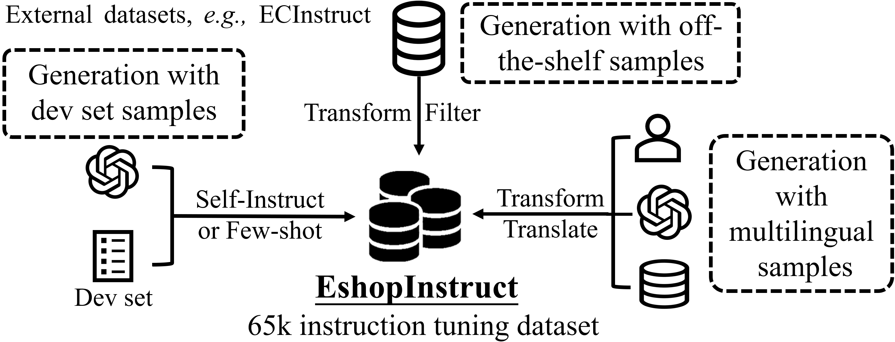

# EshopInstruct
#  **Team shimmering_as_the_stars' Solution and Dataset for Amazon KDDCup 2024 (Track 4: Rank 2, Track 1: Rank 3)** 


We utilized public datasets and OpenAI's ChatGPT and GPT-4 [^1] for the data construction of our **EshopInstruct**, whose detailed construction pipeline is shown in the following figure. More details on our methodology can be found in our workshop paper: [LLaSA: Large Language and E-Commerce Shopping Assistant](https://openreview.net/pdf?id=6cbeohZLxS).

Our data construction strategy can be categorized into three main approaches:

- We analyzed 18 tasks and their corresponding data in the development set, using this analysis to generate more data that aligns more closely with the types found in the development set.  
- Based on the practical scenarios of each track, we developed additional task types and corresponding data beyond those in the development set.  
- To increase the proportion of real-world data in the SFT dataset and provide more knowledge to the LLMs, we also created a substantial amount of data based on external datasets.  

[^1]: [OpenAI API](https://openai.com/api/) ([DBLP:journals/corr/abs-2303-08774](https://dblp.org/rec/journals/corr/abs-2303-08774.html))





We processed the raw data and obtained a total of 63,972 entries.

The dataset is categorized into **generation, multiple-choice, ranking, retrieval, and named entity recognition (NER)**, along with a **Mix** category that integrates multiple task types. Each category also contains several sub-tasks, which can be viewed in the **data viewer**.


## Load Dataset

We have uploaded the data to Hugging Face, and it can be loaded using the `datasets` library.

```python
# Install the datasets library if not installed
# !pip install datasets

from datasets import load_dataset

# Load the EshopInstruct dataset from Hugging Face
dataset = load_dataset("suyan/EshopInstruct")

# View dataset structure
print(dataset)
```


## Dataset Statistics 

| Task type       | sub-tasks                               | #Example | source              |
| --------------- | --------------------------------------- | -------- | ------------------- |
| Generation      | Category Generation                     | 1000     | Amazon-Category     |
|                 | Category Matching                       | 1000     | Amazon-Category     |
|                 | Attribute Generation                    | 1000     | OA-Mine & AE-110K   |
|                 | Bullet Generation                       | 1000     | Amazon-ESCI         |
|                 | Complements Matching                    | 1000     | Amazon-ESCI         |
|                 | Exact Match Judgement                   | 2000     | Amazon-ESCI         |
|                 | Next Item Generation                    | 1000     | Amazon-M2           |
|                 | Description Generation                  | 1000     | Amazon-ESCI         |
|                 | Title Generation                        | 1000     | Amazon-ESCI         |
|                 | Query Generation                        | 1000     | Amazon-ESCI         |
|                 | Answer Generation                       | 820      | ecinstruct          |
| Multiple-Choice | Category Classification                 | 1000     | Amazon-Category     |
|                 | Category Identification                 | 1000     | Amazon-Category     |
|                 | Next Item Selection                     | 3000     | Amazon-M2           |
|                 | Complements Selection                   | 2000     | Amazon-ESCI         |
|                 | Substitutes Selection                   | 2000     | Amazon-ESCI         |
|                 | Product Relation Prediction             | 802      | ECInstruct          |
|                 | Answerability Prediction                | 789      | ECInstruct          |
|                 | Product Substitute Identification       | 2138     | ECInstruct          |
|                 | Product Matching                        | 2197     | ECInstruct          |
|                 | Sentiment Analysis                      | 2147     | ECInstruct          |
|                 | Multiclass Product Classification       | 2156     | ECInstruct          |
|                 | Session Selection                       | 2000     | Amazon-M2           |
| NER             | Attribute Extraction                    | 4000     | OA-Mine & AE-110K   |
|                 | Attribute Value Extraction              | 2120     | ECInstruct          |
| Ranking         | Query Product Rank                      | 2185     | ECInstruct          |
| Retrieval       | Relevant Item Retrieval                 | 1000     | Amazon-ESCI         |
|                 | Complements Retrieval                   | 1936     | Amazon-ESCI         |
|                 | Substitutes Retrieval                   | 2000     | Amazon-ESCI         |
|                 | Product Retrieval（Task14）             | 4000     | ECInstruct          |
|                 | Sequential Recommendation               | 2146     | ECInstruct          |
|                 | Session Retrieval                       | 3570     | Amazon-M2           |
| Mix             | Query Relation Classification（Task11） | 27       | GPT-4               |
|                 | Task15                                  | 1000     | Amazon Reviews 2023 |
|                 | Product QA（Task5）                     | 2000     | GPT-4               |
|                 | track3_task 12                          | 2000     | Amazon-ESCI         |
|                 | kdd by ours                             | 2939     | GPT-4, Real dataset |
| Total           |                                         | 63972    |                     |


## Citation

```
@misc{zhang2024llasalargelanguageecommerce,
      title={LLaSA: Large Language and E-Commerce Shopping Assistant}, 
      author={Shuo Zhang and Boci Peng and Xinping Zhao and Boren Hu and Yun Zhu and Yanjia Zeng and Xuming Hu},
      year={2024},
      eprint={2408.02006},
      archivePrefix={arXiv},
      primaryClass={cs.CL},
      url={https://arxiv.org/abs/2408.02006}, 
}
```

